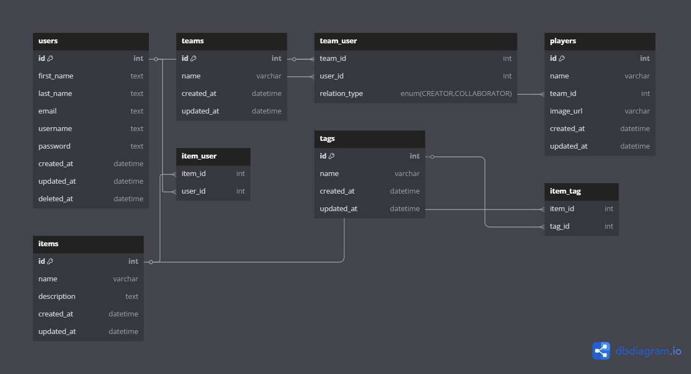

#  Mario Maker API 


##    Introdução:
No Reino dos Cogumelos, os criadores de fases se tornaram os novos heróis. Com a evolução tecnológica, foi desenvolvida a Mario Maker API, uma plataforma para que jogadores possam criar, editar e compartilhar fases, elementos e ideias para o universo Mario.

Cada criador pode trabalhar de forma independente ou formar equipes criativas, onde compartilham itens, ideias e testam suas fases antes de publicá-las. A plataforma traz um sistema de autenticação, segurança e organização dos dados para garantir a melhor experiência aos fãs e desenvolvedores do Marioverse.

🧱 [Segue link de uma documentação mais detalhada de todo o projeto](https://drive.google.com/drive/folders/1nLquFyPt_ATIwbUfIZOvkSwFpQxcCZzv?usp=sharing) 🧱 

##  Estrutura do Projeto:


## Objetivo: 

Criar uma REST API com autenticação JWT que possibilite o gerenciamento completo das entidades envolvidas na criação colaborativa de fases do Mario. A API deve permitir que os usuários:
* Se cadastrem e façam login.
* Criem e gerenciem itens (ex: blocos, inimigos, power-ups).
* Organizem os itens com tags (ex: “lava”, “voador”, “clássico”).
* Formem equipes criativas (teams) com outros criadores.
* Atribuam jogadores/personagens (players) aos projetos.
* Usem paginação e uploads locais de imagens.
* Criem relações do tipo "CRIADOR" ou "COLABORADOR" com suas equipes.

##  Tecnologias:

<div align="center" style="display: inline_block">
  
   
  
  
  
  
  
  
</div>

##  Relações do Banco de dados:


###  Entidades Principais:

| Modelo  | Descrição               | Campos Importantes                     |
|---------|-------------------------|----------------------------------------|
| `User`  | Criadores de fases      | id, username, email, password         |
| `Team`  | Equipes criativas       | id, name                               |
| `Item`  | Elementos das fases     | id, name, description, image_url       |
| `Player`| Personagens testadores  | id, name, team_id, image_url           |
| `Tag`   | Categorias de itens     | id, name                               |

###  Tabelas de Relacionamento:

| Tabela       | Relação         | Campos Especiais                      |
|--------------|-----------------|---------------------------------------|
| `team_user`  | User ↔ Team     | relation_type (CREATOR/COLLABORATOR)  |
| `item_tag`   | Item ↔ Tag      | -                                     |
| `item_user`  | Item ↔ User     | relation_type (ex: RESPONSIBLE)       |

##  Etapas do Projeto:

###  Planejamento & Arquitetura:

* Definição das entidades e relacionamentos (diagrama ER).
* Escolha das tecnologias:
  * Backend: Node.js, Express, Sequelize (SQLite).
  * Autenticação: JWT + bcrypt.
  * Uploads: Multer.
  
###  Implementação:

* Autenticação:
  * Rotas de /register e /login com validação Joi.
  * Middleware auth.js para proteger rotas.

* Users:
  * CRUD completo com soft delete.
  * Campos: username, email, password (hash).

* Items:
  * CRUD com upload de imagens (Multer).
  * Relação N:N com Tags.

* Tags:
  * CRUD simples + associação a Itens.

* Teams:
  * CRUD + sistema de membros (CREATOR/COLLABORATOR).

* Players
  * CRUD + vínculo com Teams.

###  **Validação & Testes**:

* Testes no Postman para todas as rotas.

##  Como Instalar e Executar o Projeto:

###  Pré-requisitos:
* Antes de iniciar, certifique-se de ter instalado:
* Node.js (versão 16 ou superior)
* npm ou yarn
* Git
* SQLite (para banco de dados local)

###  Clonando o repositório:
* bash:
```
git clone https://github.com/micaellimaj/Desafio-Back-End
cd projeto
```

###  Instalando as dependências:
* bash
```
npm install
# ou
yarn install
```

###  Configuração do ambiente:
* Crie um arquivo .env na raiz do projeto com:
  * env:
```
DB_PATH=./database.sqlite
JWT_SECRET=sua_chave_secreta_aqui
PORT=3000
UPLOADS_DIR=./uploads
```

###  Executando o projeto:
* bash:
```
npm start
# ou para desenvolvimento com auto-reload:
npm run dev
```

###  Acessando a API:
* O servidor estará disponível em:
```
http://localhost:3000
```
##  Demonstração no Postman:


##  Testando as Rotas:

* Utilize o Postman ou Insomnia para testar os endpoints
* Dica: Para uma experiência completa do mundo Mario, sugerimos testar as seguintes rotas com base nas entidades do projeto:


| Entidade  | Método | Rota                     | Descrição                                  | Autenticação |
|-----------|--------|--------------------------|--------------------------------------------|--------------|
| **Auth**  | POST   | `/auth/register`         | Cadastra novo usuário                      | ❌           |
|           | POST   | `/auth/login`            | Faz login e retorna token JWT              | ❌           |
| **Users** | GET    | `/users`                 | Lista todos os usuários                    | ✅           |
|           | GET    | `/users/:id`             | Busca usuário por ID                       | ✅           |
|           | PUT    | `/users/:id`             | Atualiza usuário                           | ✅           |
|           | DELETE | `/users/:id`             | Remove usuário (soft delete)               | ✅           |
| **Teams** | POST   | `/teams`                 | Cria nova equipe                           | ✅           |
|           | GET    | `/teams`                 | Lista todas as equipes                     | ✅           |
|           | GET    | `/teams/:id`             | Busca equipe por ID                        | ✅           |
|           | PUT    | `/teams/:id`             | Atualiza equipe                            | ✅ (apenas criador) |
|           | DELETE | `/teams/:id`             | Remove equipe                              | ✅ (apenas criador) |
|           | POST   | `/teams/:id/members`     | Adiciona membro à equipe                   | ✅ (apenas criador) |
|           | DELETE | `/teams/:id/members/:user_id` | Remove membro da equipe             | ✅ (apenas criador) |
| **Items** | POST   | `/items`                 | Cria item com upload de imagem             | ✅           |
|           | GET    | `/items`                 | Lista todos os itens                       | ✅           |
|           | GET    | `/items/:id`             | Busca item por ID                          | ✅           |
|           | PUT    | `/items/:id`             | Atualiza item (imagem opcional)            | ✅           |
|           | DELETE | `/items/:id`             | Remove item                                | ✅           |
|           | POST   | `/items/:id/tags`        | Adiciona tag ao item                       | ✅           |
|           | DELETE | `/items/:id/tags/:tag_id`| Remove tag do item                         | ✅           |
| **Tags**  | POST   | `/tags`                  | Cria nova tag                              | ✅           |
|           | GET    | `/tags`                  | Lista todas as tags                        | ✅           |
|           | GET    | `/tags/:id`              | Busca tag por ID                           | ✅           |
|           | PUT    | `/tags/:id`              | Atualiza tag                               | ✅           |
|           | DELETE | `/tags/:id`              | Remove tag (soft delete)                   | ✅           |
| **Players** | POST  | `/players`               | Adiciona personagem à equipe               | ✅           |
|           | GET    | `/players`               | Lista todos os personagens                 | ✅           |
|           | GET    | `/players/:id`           | Busca personagem por ID                    | ✅           |
|           | PUT    | `/players/:id`           | Atualiza personagem                        | ✅           |
|           | DELETE | `/players/:id`           | Remove personagem                          |

* Legenda:
✅ = Requer token JWT no header Authorization: Bearer <token>
❌ = Rota pública

* Dica para uso no Postman:
  * Comece registrando um usuário em /auth/register
  * Faça login em /auth/login para obter o token
  * Use o token nas demais rotas adicionando no header:
```
Authorization: Bearer seu_token_aqui
```

##  Organização dos Diretórios:


###  Todas as pastas:
```
DESAFIO-BACK-END/
├── src/
│ ├── controllers/
│ │ ├── authController.js         # Lógica de autenticação (login/registro)
│ │ ├── itemController.js         # CRUD de itens + upload de imagens
│ │ ├── playerController.js       # Gerenciamento de personagens
│ │ ├── teamController.js         # Operações com equipes
│ │ └── userController.js         # Gestão de usuários
│ │
│ ├── models/
│ │ ├── User.js                   # Modelo de usuários (criadores)
│ │ ├── Team.js                   # Modelo de equipes
│ │ ├── Item.js                   # Modelo de itens das fases
│ │ ├── Player.js                 # Modelo de personagens
│ │ ├── Tag.js                    # Modelo de categorias
│ │ ├── ItemTag.js                # Tabela de relação Item-Tag (N:N)
│ │ ├── ItemUser.js               # Tabela de relação Item-User (N:N)
│ │ ├── TeamUser.js               # Tabela de relação Team-User (N:N)
│ │ └── index.js                  # Exportação centralizada dos modelos
│ │
│ ├── routes/
│ │ ├── authRoutes.js             # Rotas de autenticação
│ │ ├── itemRoutes.js             # Rotas de itens (com upload)
│ │ ├── playerRoutes.js           # Rotas de personagens
│ │ ├── teamRoutes.js             # Rotas de equipes
│ │ ├── userRoutes.js             # Rotas de usuários
│ │ └── tagRoutes.js              # Rotas da tag
│ │
│ ├── middlewares/
│ │ └── auth.js                   # Middleware de autenticação JWT
│ │
│ └── database/
│ └── index.js                    # Configuração do Sequelize e conexão com DB
│
├── uploads/                      # Armazena imagens enviadas (itens)
├── config/
│ ├── config.json                 # Configurações do Sequelize por ambiente
│ └── db.js                       # Configurações adicionais do banco
│
├── middlewares/
│ └── auth.js                     # Middleware de autenticação
│
├── app.js                        # Configuração principal do Express
├── server.js                     # Ponto de entrada da aplicação
├── package.json                  # Dependências e scripts do projeto
├── package-lock.json             # Versões exatas das dependências
├── time.db                       # Arquivo do banco SQLite
├── .env                          # Variáveis de ambiente (JWT_SECRET, etc)
├── .gitignore                    # Arquivos ignorados pelo Git
└── README.md                     # Documentação do projeto
```
###  Arquivos Críticos:

| Arquivo               | Função                                                                 |
|-----------------------|-----------------------------------------------------------------------|
| `server.js`           | Inicializa o servidor e conecta ao banco                              |
| `app.js`              | Configura middlewares globais (CORS, JSON, uploads)                   |
| `config/db.js`        | Configuração detalhada da conexão com o banco                         |
| `database/index.js`   | Centraliza modelos e associações do Sequelize                         |
| `middlewares/auth.js` | Valida tokens JWT para rotas protegidas                               |

###  Destaques:

* Estrutura MVC clara (Models-Views-Controllers)
* Uploads gerenciados pelo Multer (pasta `/uploads`)
* Relacionamentos complexos via tabelas intermediárias
* Configuração por ambiente (dev/test/prod)

##   Conclusão:

O desenvolvimento da Mario API REST foi uma oportunidade sólida para aplicar conceitos fundamentais de construção de APIs robustas, organizadas e escaláveis. Através da separação de entidades como usuários, jogadores, times, itens e tags, foi possível construir uma estrutura modular e compreensível, respeitando boas práticas RESTful e utilizando o Sequelize como ORM para facilitar a interação com o banco de dados.

Além disso, a integração do multer para upload de arquivos, o uso de middlewares e a configuração dinâmica do ambiente com suporte a SQLite mostram a atenção aos detalhes técnicos e à flexibilidade da aplicação, tornando-a apta para crescer em diferentes contextos de uso. 

##   Agradecimento:

Agradeço imensamente a atenção e o interesse em acompanhar o projeto Mario API REST. Este trabalho é fruto de dedicação contínua e aprendizado prático, e representa mais do que uma aplicação funcional — é também um passo concreto na jornada de evolução como desenvolvedor.


